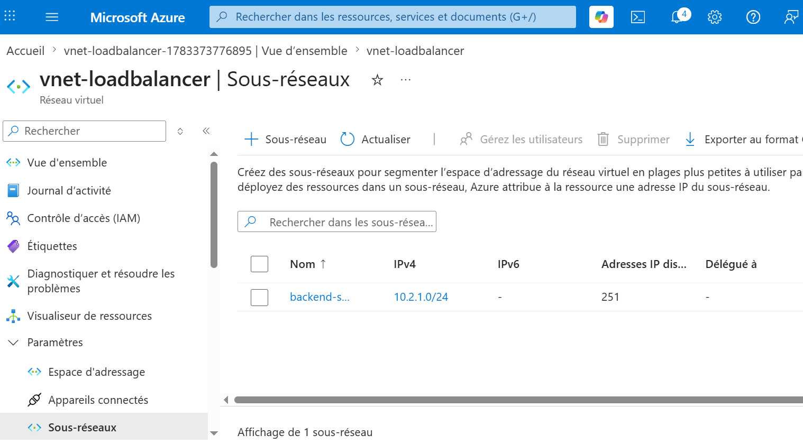
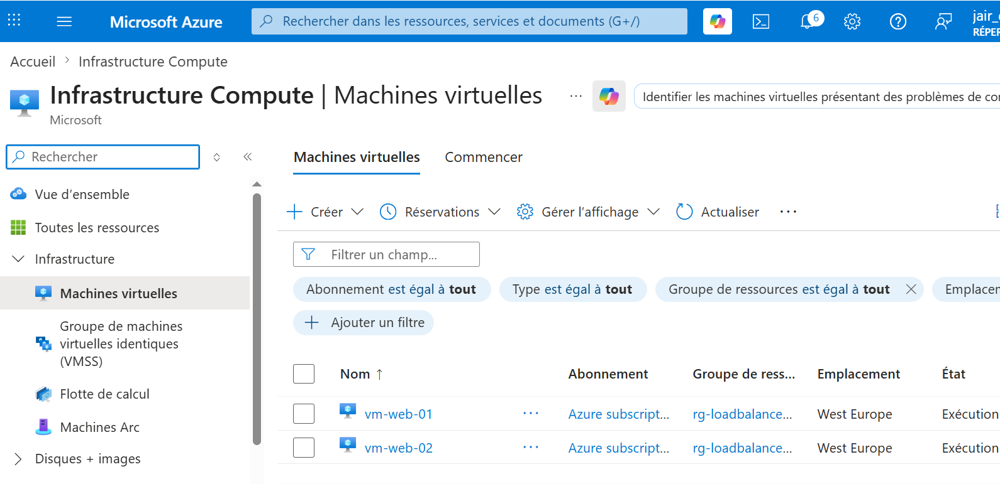
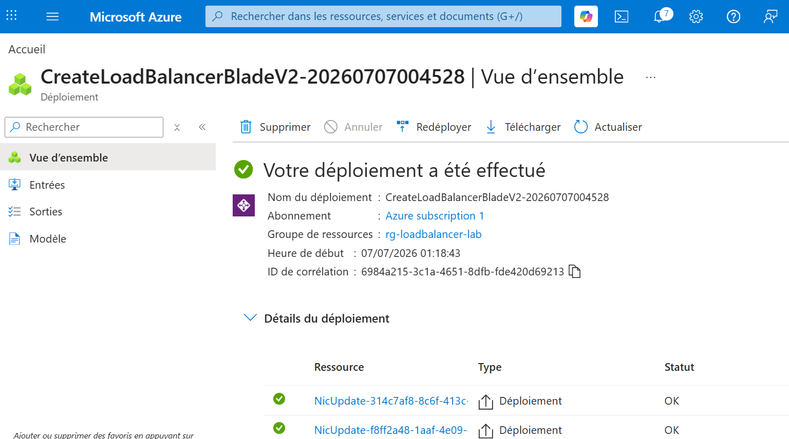
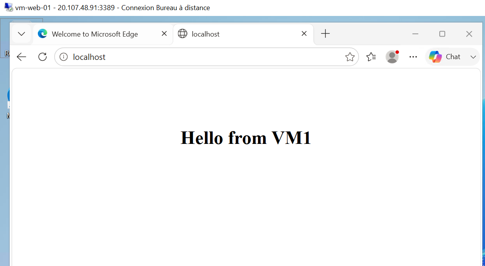
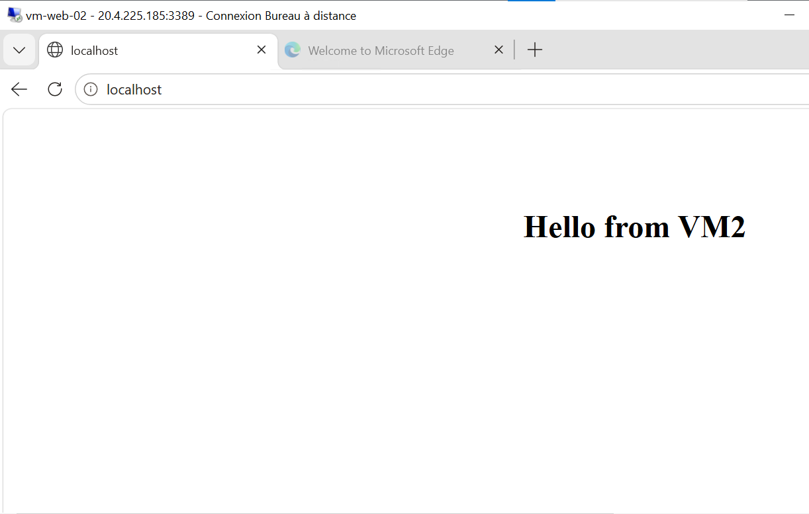
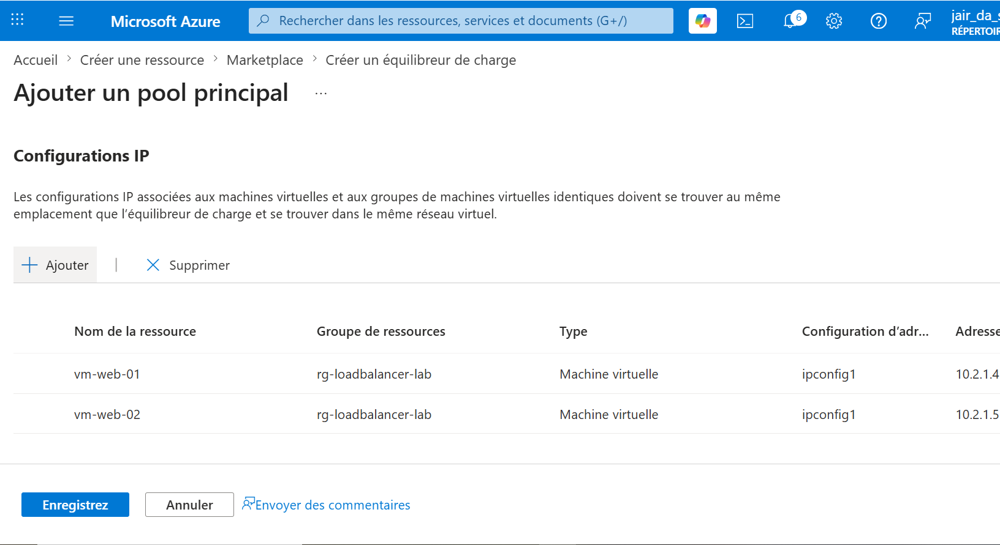

# Azure Load Balancer Lab

## 🎯 Objectif

Déployer et configurer un **Azure Standard Load Balancer** afin de répartir automatiquement le trafic HTTP entre deux machines virtuelles **Windows Server 2025** exécutant un serveur IIS.

Ce projet a été réalisé dans le cadre de ma préparation à la certification **Microsoft Azure AZ-104** afin de développer mes compétences en administration Cloud, en gestion des réseaux Azure et en mise en œuvre de solutions de haute disponibilité.

---

## 🛠️ Technologies utilisées

- Microsoft Azure
- Azure Standard Load Balancer
- Windows Server 2025
- IIS (Internet Information Services)
- Azure Virtual Network (VNet)
- Azure Subnets
- Azure Public IP
- PowerShell

---

## 🏗️ Architecture

```text
                    Internet
                        │
                        ▼
                Azure Public IP
                        │
                        ▼
            Azure Standard Load Balancer
                        │
          ┌─────────────┴─────────────┐
          ▼                           ▼
      VM-Web-01                  VM-Web-02
 Windows Server 2025         Windows Server 2025
        IIS                         IIS
          │                           │
          └─────────────┬─────────────┘
                        ▼
             Virtual Network (VNet)
                  10.2.1.0/24
```

---

## 🎯 Résultat

Grâce à Azure Load Balancer :

- le trafic HTTP est réparti entre deux serveurs IIS ;
- les deux machines virtuelles sont surveillées grâce à une **Health Probe** ;
- seules les machines virtuelles en bonne santé reçoivent le trafic ;
- la solution améliore la disponibilité de l'application.

Les tests réalisés avec PowerShell montrent que les réponses proviennent successivement de **VM1** puis de **VM2**, confirmant le bon fonctionnement de l'équilibrage de charge.

---

## 👤 Auteur

**Jair Da Silva**

Technicien Systèmes & Réseaux | Support IT N1/N2 | Microsoft Azure

GitHub : https://github.com/jairdasilva-it

LinkedIn : https://www.linkedin.com/in/jair-da-silva-6b14aa278

---

# 🚀 Étapes du projet

## 1️⃣ Création du réseau virtuel

- Création du Virtual Network
- Création du sous-réseau **backend-subnet**

---

## 2️⃣ Déploiement des machines virtuelles

- Création de deux machines virtuelles Windows Server 2025
- Déploiement dans le même sous-réseau
- Installation du rôle IIS sur chaque serveur
- Personnalisation de la page Web :
  - **Hello from VM1**
  - **Hello from VM2**

---

## 3️⃣ Déploiement du Load Balancer

- Création d'un Azure Standard Load Balancer
- Création d'une adresse IP publique
- Création du Backend Pool
- Ajout des deux machines virtuelles

---

## 4️⃣ Configuration de l'équilibrage de charge

- Création d'une Health Probe sur le port **80**
- Création d'une règle d'équilibrage HTTP
- Association du Backend Pool
- Validation de l'état **Healthy** des deux serveurs

---

## 5️⃣ Validation

- Vérification de l'accès HTTP via l'adresse IP publique du Load Balancer
- Test de répartition de charge avec PowerShell (`Invoke-WebRequest`)
- Vérification que les réponses proviennent des deux serveurs Web

---

# 📸 Captures d'écran

## 1. Réseau virtuel

Création du Virtual Network et du sous-réseau utilisé par les machines virtuelles.



---

## 2. Machines virtuelles

Déploiement des deux machines virtuelles Windows Server 2025.



---

## 3. Déploiement du Load Balancer

Création du Standard Load Balancer.



---

## 4. IIS sur VM-Web-01

Page Web personnalisée affichant **Hello from VM1**.



---

## 5. IIS sur VM-Web-02

Page Web personnalisée affichant **Hello from VM2**.



---

## 6. Backend Pool

Ajout des deux machines virtuelles dans le Backend Pool.



---

## 7. Validation du Load Balancer

Test PowerShell montrant que les réponses proviennent des deux serveurs Web.


---

# 💼 Compétences démontrées

- Déploiement d'une infrastructure Microsoft Azure
- Administration de machines virtuelles Azure
- Installation et configuration d'IIS
- Déploiement d'un Azure Standard Load Balancer
- Configuration d'un Backend Pool
- Mise en œuvre d'une Health Probe
- Configuration de règles d'équilibrage de charge
- Gestion des Virtual Networks (VNet)
- Gestion des sous-réseaux Azure
- Administration Windows Server
- Validation d'une infrastructure avec PowerShell
- Notions de haute disponibilité (High Availability)
- Préparation à la certification Microsoft AZ-104
